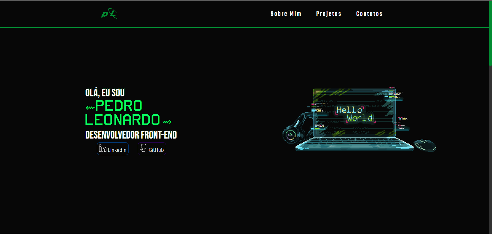

<h1 align="center": center">Portfólio - Pedro Leonardo</h1>

<h3 align="center">Confira meu Projeto <a href="https://pedrosrc.github.io/portifolio/">Aqui🔗</a></h3>
<h2>💡O intuido de criar foi:</h2>
<ul>
  <li>Me apresentar como desenvolvedor web</li>
  <li>Ajudar quem necessita de ajuda</li>
</ul>
<h2>⚙️Tecnologias Usadas:</h2>
<ul>
  <li>HTML, CSS</li>
  <li>JavaScript</li>
</ul>
